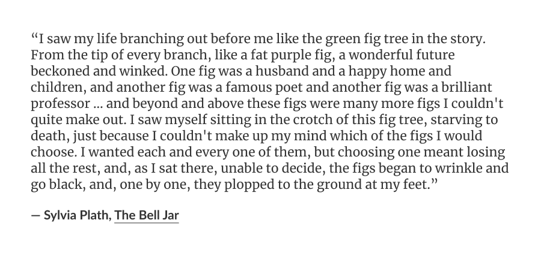

i thought i'd spend this period building things, but what do you know? a lot of it has been spent in (somewhat forced) introspection.

i'd been picking up and putting down projects, each one feeling short-sighted in a way i couldn't name. every pursuit i wanted to nurture was wildly different, and i only had this much time. 

not to be dramatic, but if you've read The Bell Jar, my past six weeks have felt a little like this:

the market prefers clean labels: designer, marketer, engineer. do i want to be a marketer or a product designer? should i lean in and become a design engineer?

god, pick a lane, Charmayne!

of course i was struggling: i was trying to answer a personal question through a professional label. in hindsight, it seems obvious that you have to do the harder, quieter work of figuring out who you are and what you want before you can communicate it to the world.

when people ask me why i left product design for marketing, i usually say that i wanted to be "closer to the business". it's a reductive answer, yes. what i really mean is that i wanted to build a fuller relationship to the work i was doing.

i moved toward marketing, partly because i wanted distribution knowledge, partly because i thought that "closer to the business" meant "closer to the decisions."

some of this touches on questions about [designers, decisions, and influence](https://substack.com/home/post/p-142227619). in my specific context, it simply felt like there were pieces missing in the whole arc of things i wanted to be able to do.

marketing, at the time, seemed like it might close the gap. and it gave me something real: distribution knowledge. the confidence that i can figure out, with reasonable success, how to take a product to market and put it in the hands of many users.

design, on the other hand, has given me craft. the joy of creating something beautiful from nothing; a toolkit for building; the ability to sweat the details. (i've always enjoyed making beautiful things.)

both curiosities were real and both are mine. together they pointed toward the same destination of ownership and agency. neither, on its own, was the thing i was actually after.

on a macro level, roles are just a form of resource optimisation: shorthand for who does what best in a company. 

i needed to define what i wanted to move toward, independent of any title. only then could roles become a useful *constraint*: something that could channel my focus for a few years, and help me compound who i already am and the kind of impact i want to make.

it took me a while to name what i was after. but when i put together:

1. what i imagine my best future work looks like,
2. what i'm naturally drawn to, and
3. what i want people to come to me for,

the roles fall away, and i'm left with what i'm unwilling to give up: **end-to-end ownership over meaningful, human work**.

i want to be someone who can conceive, build, and bring meaningful things to people — with enough autonomy to decide, enough craft to care, and enough stability to sustain myself.

the thing i'm building toward doesn't have a single job title, and that's ok.