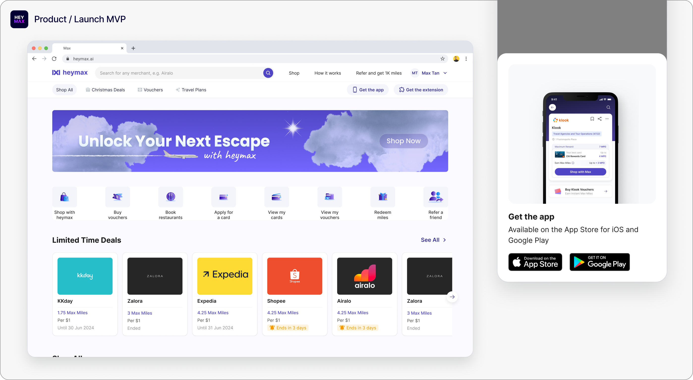
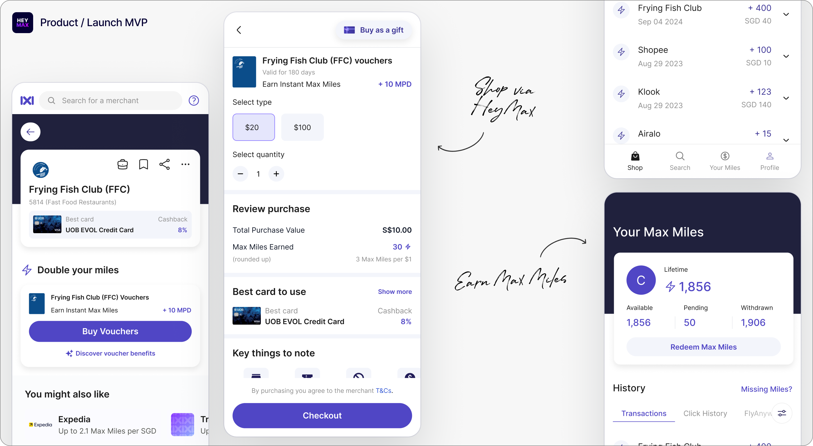
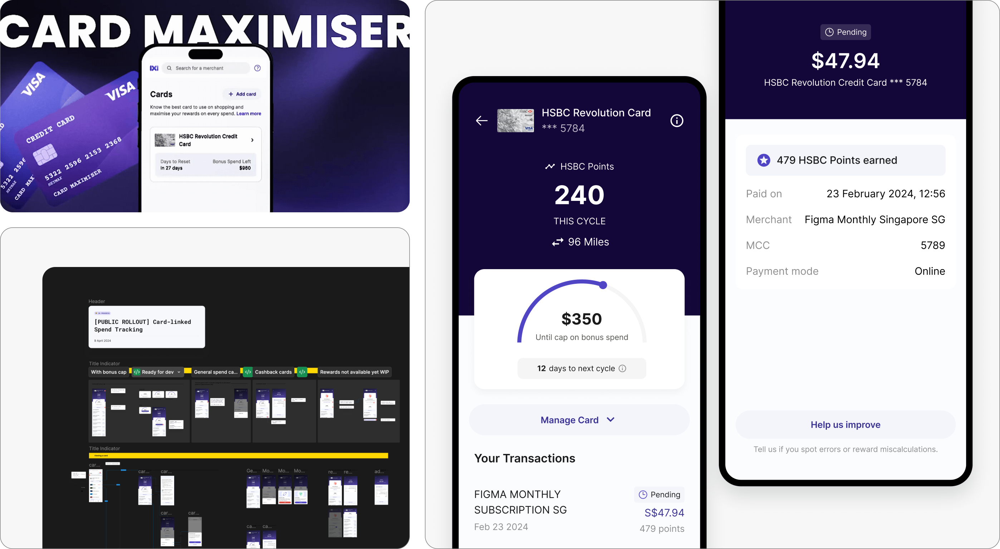
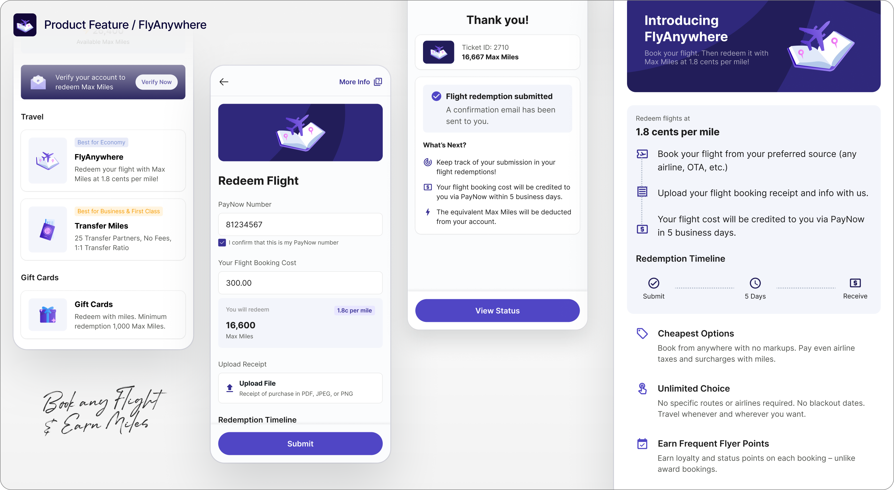
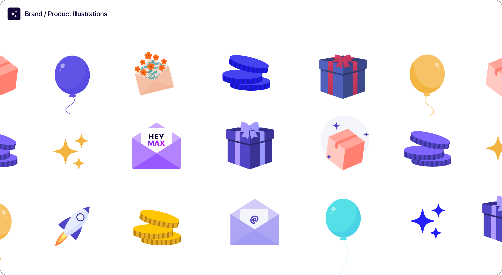

HeyMax is a loyalty and travel rewards platform that allows consumers to earn and redeem its reward currency, Max Miles, for travel rewards. 

I joined as the founding designer to define the product experience from zero to one, and translate a complex fintech value proposition — layered rewards on top of existing credit cards — into an intuitive mobile and web experience.

## Launch MVP

If there’s one story that captures what it was like to be the sole designer in HeyMax’s early days, it’s how we launched Max Miles — HeyMax’s flagship travel rewards currency, that lets users earn miles on everyday spend.

:::annotation{side="right" arrow="curve-right"}
Tap to view
:::

I designed the MVP in a few days. We launched in 2 weeks, close to midnight, just before 9.9 —a major shopping day. The next morning, the popular miles blog, MileLion, had written about us. In a day, we were ranking #1 on the Singapore app store.

