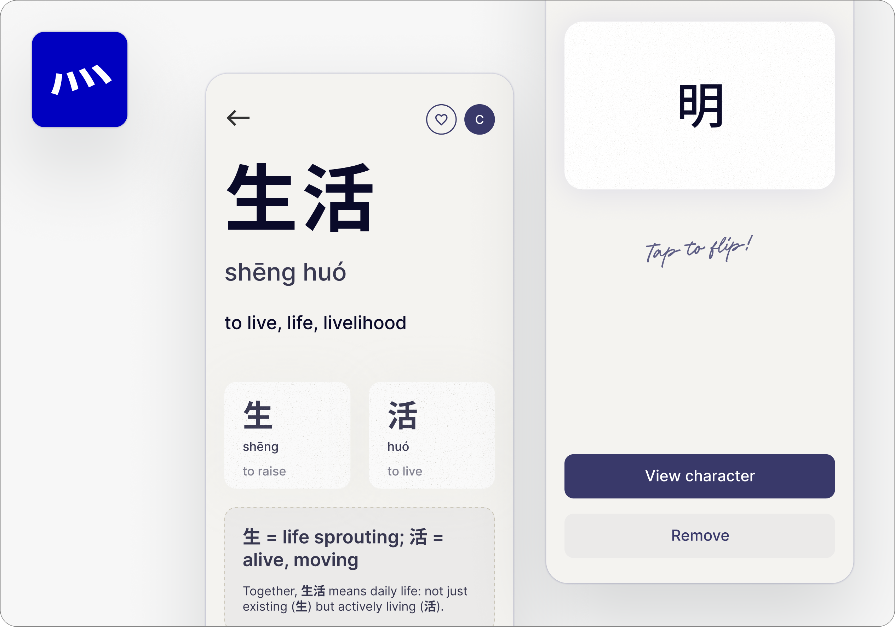

Sidi is a Chinese reading tool for serious Chinese learners looking to build real fluency by recognizing patterns in the structure of Chinese characters.

I'm currently building this, watch this space for updates :)

## <b>16 Feb 2026</b>
back after a bit of a break. here's how i'm phasing the MVP development:

- Phase 0: data import and infrastructure
- Phase 1: core lookup (search and detail pages - no auth)
- Phase 2: generation (LLM pipeline)
- Phase 3: auth and save to deck
- Phase 4: further design, testing, deploy

## <b>12 Jan 2026</b>
MVP has two flows:
- Lookup: Search → result → detail page
- Save to deck: Requires login, lets you build a personal deck

There are 5 "levels" of entities that need different treatment.

1. Compound word (e.g., 电脑): Multi-character word
2. Composite character (e.g., 明): Built from multiple components
3. Simple character (e.g., 日): Single semantic unit
4. Primitive (e.g., 氵): Modifies meaning, rarely stands alone
5. "Derived" primitive: Variant form of another component

Each level needs a different design treatment. L1 shows word-level breakdown, L2 shows character components, and L3–L5 show etymology and usage.

### What I'm working on next:
- Finalize detail page design for each entity level
- Build search + result flow
- Design the AI prompt for generating breakdowns
- Figure out save/deck system (login required)
  

## <b>Before Jan 9: The manual approach</b>

I started with the idea of building my own dataset, but it seemed high friction and not very sustainable. Building a comprehensive, accurate dataset would take a lot of effort.

Landed on a scoped v0. I would curate 500–700 characters, Simplified Chinese only, 1-2 core user flows, and see how it goes

I also decided on web app over iOS for now to have the lowest possible barrier to iterating / shipping without dealing with app store reviews.

## <b>Jan 9: wait, i can just use AI</b>

Realised that instead of curating a static dataset, I could use AI for the character breakdowns. This shifts the entire approach. I can support the full character set from day one and ship much faster.

My thinking on ICP has shifted. Heritage learners were my initial focus, but the opportunity is broader: serious, intermediate learners frustrated with retention and comprehension. The pain point is universal.

I looked at the competitive landscape more closely and did some product teardowns:

<li><a href="https://hanzihero.com">HanziHero</a> uses English mnemonics, a different approach that relies on memory tricks rather than structural understanding.</li>
<li><a href="https://www.hanlyapp.com">Hanly</a> is the closest thing to what I'm building. It has component breakdowns, but they're baked into a structured HSK 0–6 course. It's completely beginner-focused, which means it's not useful if you're already at an intermediate level.
</li>

### Notes for later: 

I should consider adding stroke order, and spaced repetition flashcards for feature parity, but it's not critical for v0
Considered going mobile again because demand validation is much stronger now, but chose to stick with web to ship faster

